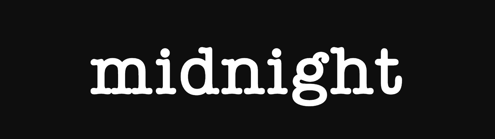
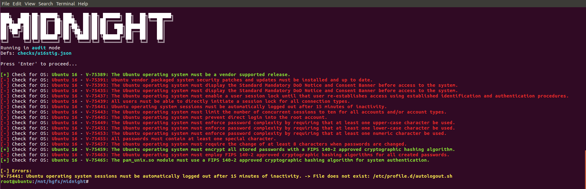

<p align="center">
  
</p>

<h3 align="center">
  <i>
    An extensible security auditing tool
  </i>
</h3>

<p align="center">
  
  
  
  
  
  
</p>

<hr>

## 💡 Features

- System audit to report vulnerabilities
- Based on STIGs and (in the future) CIS Controls
- User can specify custom controls in JSON
- Ability to run on virtual machines with Docker

## ✨ In Action

<p align="center">
  
</p>

## 💻 Try it out

```sh
git clone https://github.com/safinsingh/midnight.git
bash install.sh
go build .
./midnight -file checks/u16stig.json
```

## 🔮 Usage

```sh
./midnight -h

# output

Usage of ./midnight:
  -file string
        Configuration file to use (mandatory)
  -mode string
        Mode to run midnight in. Possible modes: audit, enforce, docker (default "audit")

```

## 👨‍💻 Author

Linkedin: [Safin Singh](https://www.linkedin.com/in/safin-singh-b2630918a/) <br>
GitHub: [safinsingh](https://github.com/safinsingh) <br>
Dribbble: [Safin Singh](https://dribbble.com/safinsingh/) <br>
YouTube: [Safin Singh](https://www.youtube.com/channel/UCvb01sUdAgcPAG1j0SLxAtA)

## 🤝 Contributing

Contributions, PRs, issues and feature requests are welcome! Feel free to check out my [issues page](https://github.com/safinsingh/midnight/issues).

## ❤️ Show your support

Give a ⭐️ if this project helped you!
Hope you enjoy it!
